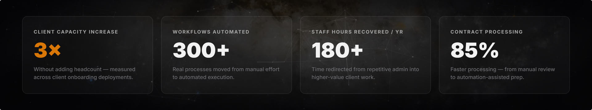
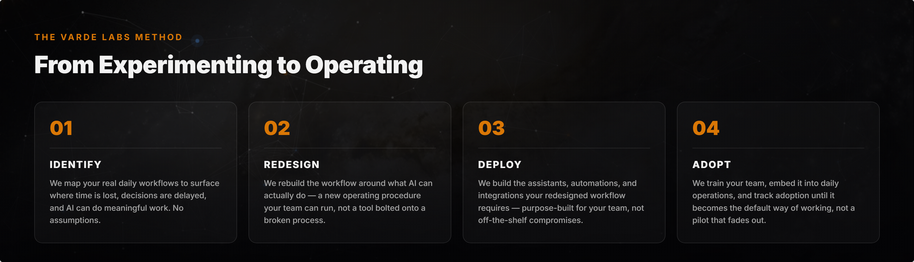
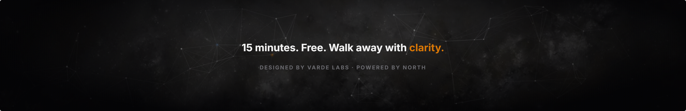

<picture>
  <source media="(prefers-color-scheme: dark)" srcset="assets/logo-combomark-light.svg" />
  
</picture>

### We get teams from *experimenting* with AI to *actually operating* with it.
Real adoption across your workflows in 20 days, not 6 months.

 

## What We Do

Varde Labs is an **AI adoption agency**. We don't sell off-the-shelf AI tools and walk away. We map how a firm actually runs, redesign the workflow around what AI can really do, build the assistants and automations that workflow needs, and stay until the team has adopted it as the default way of working.

Built for professional services and financial firms with **2–200 employees**, running operations across disconnected systems, without the internal AI expertise to fix them.

## The Varde Labs Method

## Who We Work With

<table>
<tr>
<td width="220">🏦 <strong>Financial Services</strong></td>
<td>Client onboarding bottlenecks, contract preparation that eats hours, compliance tracking across disconnected tools. We automate the repeatable work so the team focuses on advisory.</td>
</tr>
<tr>
<td>💼 <strong>Professional Services</strong></td>
<td>Proposal generation, knowledge retrieval, project delivery tracking. Every hour spent on admin is an hour not spent on client work. We fix that math.</td>
</tr>
<tr>
<td>⚙️ <strong>Operations-Heavy SMBs</strong></td>
<td>Scheduling chaos, system fragmentation, manual handoffs between tools that don't talk to each other. We connect them and automate the work in between.</td>
</tr>
</table>

## What Clients Say

> "Our sales guy said the contracting phase went from a two-to-three-hour slog to about 25 minutes… huge. And that's not including all the follow-up and all the system maintenance time saved for me."
> — **Eli Kaplovitz**, CEO & Founder, AIDACE

> "We can handle more clients and build intense personal relationships because the administrative work is off our plate."
> — **Bill Gombert**, Owner, The Financial Architects

> "Kai & Bryan have gone above and beyond… Their personalized, creative solutions are tailored to our operations and goals. Their professionalism and genuine commitment are unparalleled."
> — **Sydney Snyder**, Office Manager, TFAUSA

## More From Varde Labs

[Book a Meeting](https://book.vardelabs.com) · [North Assistant](https://vardelabs.com/northstar/) · [Free AI Review](https://vardelabs.com/review/) · [AI Assistant Playbook](https://vardelabs.com/ai-assistant-playbook/) · [Finance Case Study](https://vardelabs.com/finance-case-study/)

 

### Team

   

© 2026 Varde Labs

